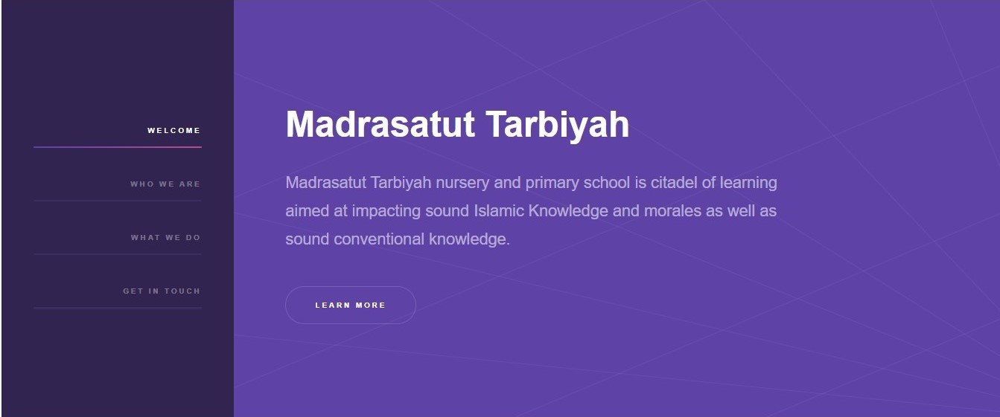
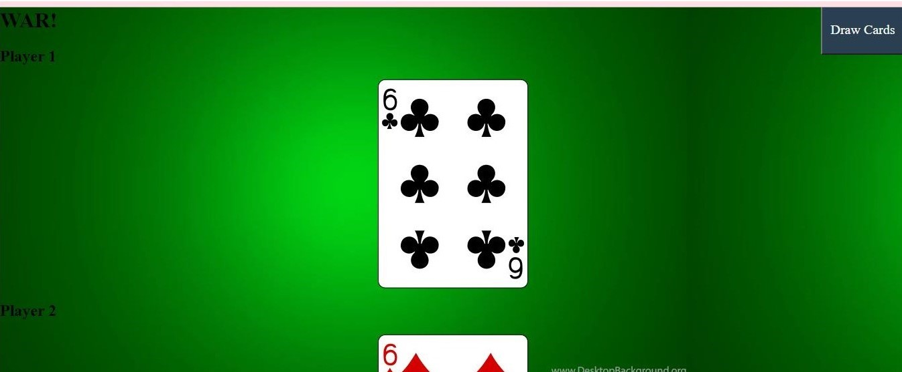

# Portfolio-2021 : <a target="_blank" href="https://www.azeezroheem.netlify.app">Visit Here</a>

<a target="_blank" href="https://www.azeezroheem.netlify.app">
</img>

</a>

### Portfolio Site including links to my projects and ways to get in contact with me.

## Tech used: 

I was interested in learning ways of improving the UI and smooth UX, along with nice animation for 
dark-mode.

## Optimizations

I intend to improve this project intermitently. At the moment, I have completed the necessary front-end optimization effects, and will also add  other too into the Date checker. Continous improvement of the javascript (and gifs) to the front page.

## Lessons Learned:

I initially had challenges replecating this fonts, especially the animations. Also, seperation of concerns and simplifying the codes aided the timely completion.

## More Projects

<table bordercolor="#66b2b2">
  
  <tr>
    <td width="33.3%"  style="align:center;" valign="top">
<a target="_blank" href="https://github.com/Azeez1314/trekguide">Trekguide.netlify.app</a>
         
      
    </td>
    <td width="33.3%" valign="top">
<a target="_blank" href="https://github.com/Azeez1314/madrasatut-tarbiyah">Madrasatut Tarbiyah</a>
       
        
    </td>
    <td width="33.3%" valign="top">
<a target="_blank" href="https://github.com/Azeez1314/play-card-game">Play Card Game</a>
         
        
    </td>
  </tr>
</table>
